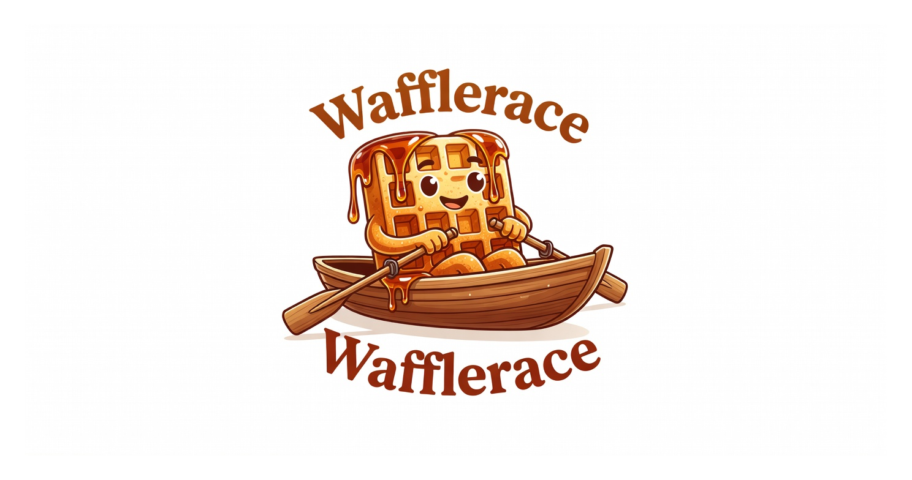

<p align="center">
  
</p>

<h1 align="center">Wafflerace</h1>

<p align="center">
  <strong>A warm, syrupy, waffle-themed animated race for random selection.</strong>
</p>

<p align="center">
  The cozy cousin of the classic browser duck race — built for streamers, giveaways, raffles, and fun decision-making moments.
</p>

<p align="center">
  <strong>🧇 Premium AI-generated waffles racing in boats.</strong><br>
  Maximum suspense. Winner only clear at the buzzer.
</p>

<p align="center">
  <a href="https://github.com/notfixingit3/wafflerace/actions"></a>
  <a href="https://www.docker.com/"></a>
  <a href="https://templ.guide/"></a>
  <a href="https://daisyui.com/"></a>
</p>

---

## What is this?

Wafflerace is a premium, syrupy recreation of the classic browser duck race — built for streamers, giveaways, raffles, and dramatic random selections.

Paste a list of names, set the duration, and watch real AI-generated waffles paddle their boats with chaotic, variable speeds and natural bobbing. The race is deliberately engineered so the winner only becomes obvious in the final seconds.

It uses high-quality generated assets (50+ boat sprites + layered river backgrounds) instead of simple drawings, plus subtle synthesized audio and particles for a more alive, 2026-feeling experience.

This is a companion project to [Project Syrup](https://github.com/notfixingit3/waffle).

---

## Current Status

**v0.1.7** — Major feature expansion and foundation hardening:
- Full backend persistence with SQLite (races, history, saved lists)
- Spectator mode + public race links
- Live "Current Leaders" sidebar
- Race templates / quick starts
- Significantly improved history and results UI
- Better error handling across the app
- Frontend testing foundation (Vitest)
- Extracted race logic for maintainability
- ESLint + Prettier enforced

Wafflerace now uses high-quality AI-generated boat sprites and river backgrounds instead of programmer art. The race emphasizes maximum suspense: boats move with chaotic, variable speeds, but no one visually reaches the finish line until the very final seconds.

### Key Features (v0.1.7)

- Backend persistence with SQLite (races, participants, results, saved name lists)
- Public race links + Spectator mode (view-only)
- Live "Current Leaders" sidebar during race
- Race templates and quick starts
- "I need to pee" pause button + Run Again workflow
- Name display options + Hide Controls
- Race history with better UI
- Parallax backgrounds, particles, synthesized audio
- Strong visual clamping for maximum suspense
- Frontend testing foundation with Vitest
- Improved error handling and code quality (ESLint/Prettier)
- 50 unique right-facing AI boat sprites with subtle rocking and reactive name flags
- Parallax scrolling backgrounds (3 layers at different speeds, randomly selected each race)
- Synthesized audio: gentle water drone, splashes on big surges, and a win chime
- Particle effects (syrup drips and small splashes)
- Smooth loading progress screen while assets load
- Extremely aggressive final-phase jitter and rubber-banding
- Strong visual clamping so the leader stays well back until the buzzer
- "I need to pee" pause button
- Quick duration presets (15s–5min in 30s steps) + manual input
- Name display options (full / short / hidden)
- Hide controls during race for cleaner presentation
- Race history (last 10 runs stored locally)
- "Run Again with same names" workflow
- Touch-friendly setup screen for tablets
- Up to 50 participants with smooth 60fps canvas animation
- Clean results with podium + full field (no times shown)
- Docker + Traefik + CrowdSec ready for production deployment

See the [changelog](https://github.com/notfixingit3/wafflerace/releases/tag/v0.1.1) for full details.

---

## Tech Stack

- **Backend**: Go + Gin
- **Frontend**: Templ + HTMX + Tailwind CSS + DaisyUI
- **Animation**: HTML Canvas (for smooth performance at higher participant counts)
- **Packaging**: Docker + Docker Compose
- **Philosophy**: Keep it simple and boring. Readable names over clever ones.

---

## Deployment

Wafflerace is designed to run behind **Traefik** with automatic Let's Encrypt SSL and protected by **CrowdSec**.

Two compose files are provided:

| File                        | Purpose              | Recommended For     |
|----------------------------|----------------------|---------------------|
| `docker-compose.dev.yml`   | Development          | Local / Staging     |
| `docker-compose.prod.yml`  | Production           | Live deployments    |

### Important: Customization Required

**Before running either compose file, open it and complete the "PREREQUISITES / CUSTOMIZATION CHECKLIST"** located right after the `version:` line at the top.

This checklist covers:
- Let's Encrypt email
- All hostnames / domains
- CrowdSec bouncer API key
- External network name (`proxy`)
- Production image version pinning

See [README-dev.md](README-dev.md) for more details.

---

## Relationship to Project Syrup

Wafflerace is a companion project to [Project Syrup](https://github.com/notfixingit3/waffle).

The long-term goal is to be able to use (or embed) the race functionality inside the main waffle application when needed for random draws, giveaways, or fun community moments.

For now it is developed as its own focused tool.

---

## Development

Active work happens on the `dev` branch.

The `main` branch is kept stable and contains the current README plus minimal supporting files.

### Local Development

```bash
docker compose up -d --build
```

Then visit `http://localhost:9090`.

See [README-dev.md](README-dev.md) for production-style Traefik + CrowdSec setup.

### For Contributors

See [AGENTS.md](AGENTS.md) for architecture decisions, rules (including the Scooby-Doo commit requirement), and important context.

### Commit Messages

Every commit must end with a random Scooby-Doo quote. Examples:

- "Ruh-roh!"
- "Zoinks!"
- "Jinkies!"
- "Would you do it for a Scooby Snack?"
- "Puppy Power!"

---

## Special Thanks

Wafflerace exists because two glass artists kept running great waffles the hard way.

[**Dani Boo Glass**](https://www.instagram.com/dani_boo_glass/)  
[](https://www.instagram.com/dani_boo_glass/)

[**Crysis Designs**](https://www.instagram.com/crysis_designs/)  
[](https://www.instagram.com/crysis_designs/)

Special shout out to [Dani Boo Glass](https://www.instagram.com/dani_boo_glass/) and [Crysis Designs](https://www.instagram.com/crysis_designs/) for creating the original Waffle and for driving me nuts watching them copy/paste spot lists over and over again in chat.

---

## License

MIT — do whatever you want.

---

<p align="center">
  If this project helps you run smoother races, consider buying me a coffee:
</p>

<p align="center">
  <a href="https://www.buymeacoffee.com/notfixingit">
    
  </a>
</p>

---

<p align="center">
  <em>Built with 🧇, maple syrup, and a concerning number of late nights.</em>
</p>
