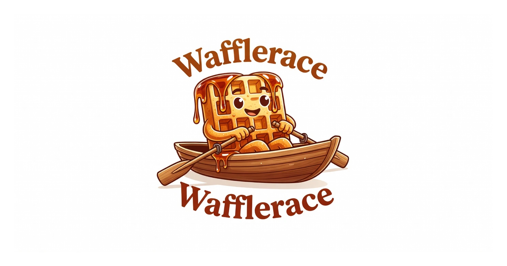

<p align="center">
  
</p>

<h1 align="center">Wafflerace</h1>

<p align="center">
  <strong>A warm, syrupy, waffle-themed animated race for random selection.</strong>
</p>

<p align="center">
  The cozy cousin of the classic browser duck race — built for streamers, giveaways, raffles, and fun decision-making moments.
</p>

<p align="center">
  <strong>🧇 Premium AI-generated waffles racing in boats.</strong><br>
  Maximum suspense. Winner only clear at the buzzer.
</p>

<p align="center">
  <a href="https://github.com/notfixingit3/wafflerace/actions"></a>
  <a href="https://www.docker.com/"></a>
  <a href="https://templ.guide/"></a>
  <a href="https://daisyui.com/"></a>
</p>

---

## What is this?

Wafflerace is a premium, syrupy recreation of the classic browser duck race — built for streamers, giveaways, raffles, and dramatic random selections.

Paste a list of names, set the duration, and watch real AI-generated waffles paddle their boats with chaotic, variable speeds and natural bobbing. The race is deliberately engineered so the winner only becomes obvious in the final seconds.

It uses high-quality generated assets (50+ boat sprites + layered river backgrounds) instead of simple drawings, plus subtle synthesized audio and particles for a more alive, 2026-feeling experience.

You can browse the current boat collections and backgrounds directly:
- [Boat Collections](assets/boats/README.md)
- [Background Collections](assets/backgrounds/README.md)

This is a companion project to [Project Syrup](https://github.com/notfixingit3/waffle).

---

## Current Status

**v0.1.15** — Water Alignment, Ripples, and Transparent Sprites

This release resolves the visual boat alignment issues, ensuring boats stay on the water surface and features dynamic water rendering and cleaned sprite transparency.

- **Water Alignment** — Constrained all boat lanes to the water surface (Y=205 to Y=380), preventing boats from spilling onto the sky/riverbank.
- **Dynamic Water Ripples & Wake** — Added procedurally-animated trailing wake waves and pulsing sub-hull water ripples under each boat.
- **Clean Boat Transparency** — Scanned default collections and removed solid background boxes from all remaining opaque boat sprites (12, 22, 34, 35, 36, 38, 43, 48), generating fully transparent WebPs.

**v0.1.14** — Design Refresh, Sprites Transparency, Refined Procedural Audio & Camera Pacing

This release brings Wafflerace up to a premium 2026 developer look and feel, adds procedural audio sweeps, improves visual pacing dynamics, and ensures all default collection boat sprites are fully transparent.

- **Design Refresh** — Replaced flat backgrounds with a stark white developer dot-grid layout, minimal slate/zinc borders, and responsive template designs aligned with projectsyrup.app.
- **Boat Sprites Transparency** — Scanned default collections and removed solid backgrounds from 6 opaque default boat sprites, generating fully transparent WebP and PNG assets.
- **Seamless Parallax Backgrounds** — Implemented alternating horizontal mirroring for repeating background tiles, creating a mathematically seamless parallax scrolling loop for all background images without visible seams.
- **Preloader Autoload Fix** — Rebuilds background parallax layers inside the draw loop immediately as images load, ensuring background assets display on page load without needing a restart.
- **Clean Canvas (No Drip Particles)** — Removed the dropping syrup dot particles during the race to keep the visual simulation clean and focused.
- **Natural Breakaway Sprint** — Tapered the timing sync feedback loop down to 10% in the final phase, letting boats sprint and breakaway to the finish line naturally.
- **Sugar Rush Engaged Banner** — Added a glowing, pulsing "⚡ SUGAR RUSH ENGAGED! ⚡" HUD overlay banner that flashes on canvas during the final sprint phase to add drama to the breakaway dash.
- **Procedural Water Splash Sound** — Synthesized a soft, natural splash combining a sine bubble sweep and bandpass-filtered noise, eliminating the annoying synthesizer beep.
- **Throttled Final-Phase Audio** — Splash sounds trigger on a 20% random frame check in the final phase, creating a sporadic and natural atmosphere instead of a rhythmic buzz.
- **Visual Camera Pacing** — Stretched the camera progress curve so boats take longer to reach the visual center of the screen, arriving at 50% screen width at exactly 50% race progress (previously 30%).
- **E2E & Handlers Coverage** — Added Playwright E2E full journey tests, SQLite test db isolation, table-driven API handler tests, and expanded Vitest unit test coverage.

See the [changelog](CHANGELOG.md) for the full list of changes. Run `npm test` for unit tests and `npm run test:e2e` for end-to-end tests.

**v0.1.13** — Frontend Testing & Race Creation Hardening

This release focuses on making the most critical user entry point (creating and starting a race) the most reliable and well-tested part of the application.

- **Race creation extracted** — All creation logic moved from inline template scripts into `web/static/js/race-logic.js` as proper, testable ESM functions.
- **31 Vitest unit tests** — Comprehensive coverage of parsing, validation, payload building, API calls, form handling, and redirect URL construction.
- **6 Playwright E2E tests** — Full browser flows including the "Test Race" button, duration presets, collections, and special characters.
- **Real bug fixed** — A production-breaking "Unexpected token 'export'" error on the race page (after creation) was discovered and fixed thanks to the new E2E layer.
- **Test infrastructure** — Added Playwright + auto-starting dev server configuration for reliable E2E runs.

**v0.1.12** — Infrastructure & Sustainability Release

This release focused on making Wafflerace easier to run, deploy, and maintain long-term:

- **Docker publishing** — Official multi-arch images (amd64 + arm64) with provenance, SBOM, and attestations are now published to GHCR on every release.
- **Development images** — A `:dev` image (plus `sha-` tags) is automatically published on pushes to the `dev` branch.
- **Simplified deployment** — Compose files no longer bundle Traefik or CrowdSec. They are now lightweight and designed to work with an existing reverse proxy.
- **Release process** — All `v*` tags must come from the `dev` branch (enforced in CI).
- **Documentation** — Significant improvements to guides and contributor experience.

**v0.1.9** — Major asset milestone

- Completed the Flags of US boat collection (all 50 states).
- Launched the Flags of the World collection (first batch of countries).
- Improved the boat collections system to properly support themed/named collections.

Wafflerace uses high-quality AI-generated boat sprites and layered river backgrounds. The race is deliberately designed for maximum suspense — the winner only becomes visually obvious in the final seconds.

### Core Features

- Real-time animated race with up to 50 participants
- Strong visual clamping and final-phase jitter so no one looks like the winner until the end
- Parallax river backgrounds and particle effects
- Synthesized audio (water drone + splashes + win chime)
- Spectator mode with shareable links
- Full race history + analytics
- Boat collections / themes support
- Docker-ready (works well behind existing Traefik + optional CrowdSec)
- Growing test suite: Vitest (unit) + Playwright (E2E) focused on the race creation flow

---

## Tech Stack

- **Backend**: Go + Gin
- **Frontend**: Templ + HTMX + Tailwind CSS + DaisyUI
- **Animation**: HTML Canvas (for smooth performance at higher participant counts)
- **Packaging**: Docker + Docker Compose
- **Philosophy**: Keep it simple and boring. Readable names over clever ones.

---

## Deployment

Wafflerace is designed to run behind an **existing Traefik** reverse proxy (and optionally behind CrowdSec). We no longer bundle a reverse proxy or security layer.

The compose files now contain **only the application** plus the Traefik labels it needs.

### Assumptions
- You already have Traefik running (with an external Docker network, usually called `proxy`).
- If you use CrowdSec, you have already configured a middleware (commonly `crowdsec@file`).

### Quick Start

**Easiest option — no reverse proxy:**

```bash
docker compose up -d --build
```

Visit `http://localhost:9090`.

**Using your own Traefik:**

1. Make sure the `proxy` network exists:
   ```bash
   docker network create proxy
   ```

2. Edit the labels in `docker-compose.dev.yml` (development) or `docker-compose.prod.yml` (production) with your domain.

3. Start the app:
   ```bash
   docker compose -f docker-compose.prod.yml up -d
   ```

See the **Docker Images** section and the comments inside the compose files for full guidance and label examples.

---

## Relationship to Project Syrup

Wafflerace is a companion project to [Project Syrup](https://github.com/notfixingit3/waffle).

The long-term goal is to be able to use (or embed) the race functionality inside the main waffle application when needed for random draws, giveaways, or fun community moments.

For now it is developed as its own focused tool.

---

## Development

Active work happens on the `dev` branch.

The `main` branch is kept stable and contains the current README plus minimal supporting files.

### Local Development

```bash
docker compose up -d --build
```

Then visit `http://localhost:9090`.

See the compose files themselves for Traefik label examples when using an external reverse proxy.

### Getting Started with Docker (Quick)

**Easiest option (no reverse proxy):**

```bash
docker compose up -d --build
```

Visit http://localhost:9090.

**Using your own Traefik:**

1. Create the external network if it doesn't exist:
   ```bash
   docker network create proxy
   ```

2. Edit the labels in `docker-compose.dev.yml` or `docker-compose.prod.yml` with your domain.

3. Start the app:
   ```bash
   docker compose -f docker-compose.prod.yml up -d
   ```

For more details, see the comments inside the compose files and the Docker Images section below.

### Docker Images

Wafflerace publishes official images to GitHub Container Registry (GHCR).

**Available tags:**

- **Stable releases** (`v*` tags from the release workflow):
  - `ghcr.io/notfixingit3/wafflerace:<version>` — e.g. `v0.1.12`
  - `ghcr.io/notfixingit3/wafflerace:latest`

- **Development / bleeding edge** (built on every push to `dev`):
  - `ghcr.io/notfixingit3/wafflerace:dev`
  - `ghcr.io/notfixingit3/wafflerace:sha-<short-sha>` — for pinning to an exact commit

**Note:** The `:dev` image skips rebuilds for documentation-only changes.

**Recommended usage:**

| Use Case                  | Recommended Image                          | Notes                                      |
|---------------------------|--------------------------------------------|--------------------------------------------|
| Production / Staging      | `:latest` or a pinned `:<version>`         | Always prefer pinning in production        |
| Testing latest changes    | `:dev`                                     | Fast way to try work from the dev branch   |
| Reproducible / debugging  | `:sha-xxxx`                                | Pins to a specific commit                  |
| Local development         | Build locally (`build: .`)                 | Best when actively modifying the code      |

See the compose files for ready-to-use examples (including how to switch between building locally and using pre-built images).

All releases are created from the `dev` branch (enforced by CI).

#### Asset Conversion Helpers

We use WebP as the primary format for boats and backgrounds (much smaller files).

Useful commands:

```bash
npm run convert:boats          # Convert boat sprites to WebP
npm run convert:backgrounds    # Convert backgrounds to WebP
```

When creating new boat assets, **boats must always face right**. See `assets/boat-concepts/README.md` for the full rules.

### For Contributors

See [AGENTS.md](AGENTS.md) for architecture decisions, rules (including the Scooby-Doo commit requirement), and important context.

### Commit Messages

Every commit must end with a random Scooby-Doo quote. Examples:

- "Ruh-roh!"
- "Zoinks!"
- "Jinkies!"
- "Would you do it for a Scooby Snack?"
- "Puppy Power!"

---

## Special Thanks

Wafflerace exists because two glass artists kept running great waffles the hard way.

[**Dani Boo Glass**](https://www.instagram.com/dani_boo_glass/)  
[](https://www.instagram.com/dani_boo_glass/)

[**Crysis Designs**](https://www.instagram.com/crysis_designs/)  
[](https://www.instagram.com/crysis_designs/)

Special shout out to [Dani Boo Glass](https://www.instagram.com/dani_boo_glass/) and [Crysis Designs](https://www.instagram.com/crysis_designs/) for creating the original Waffle and for driving me nuts watching them copy/paste spot lists over and over again in chat.

---

## License

MIT — do whatever you want.

---

<p align="center">
  If this project helps you run smoother races, consider supporting the work:
</p>

<p align="center">
  <a href="https://www.buymeacoffee.com/notfixingit">
    
  </a>
  &nbsp;&nbsp;or&nbsp;&nbsp;
  <a href="https://www.instagram.com/crysis_designs/">
    <strong>sponsor the next wubble</strong> by contacting Crysis Designs on Instagram
  </a>
</p>

---

<p align="center">
  <em>Built with 🧇, maple syrup, and a concerning number of late nights.</em>
</p>
