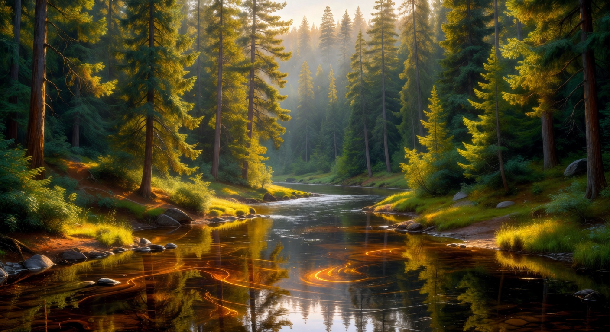
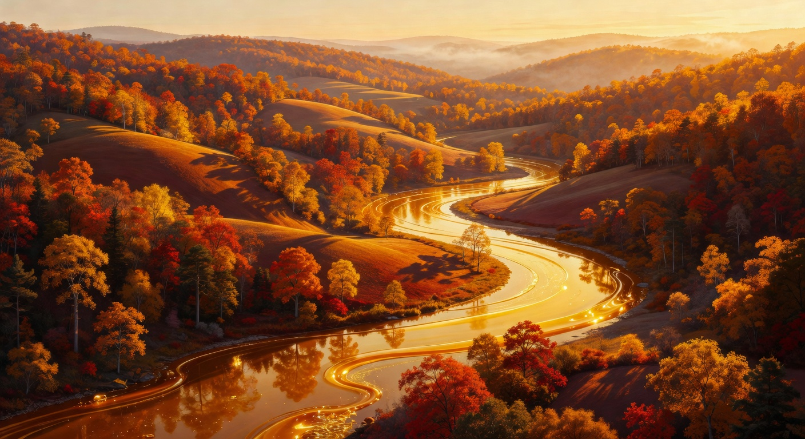
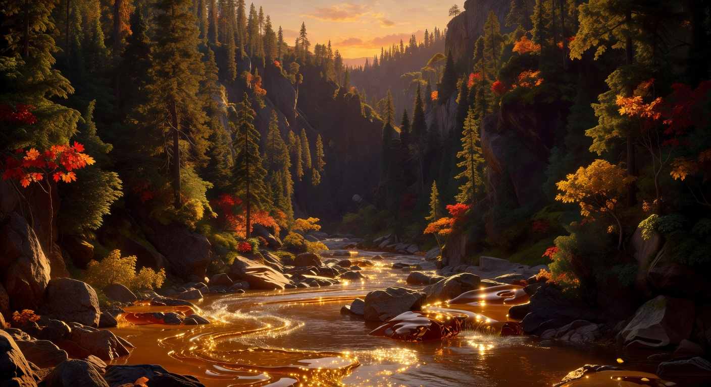
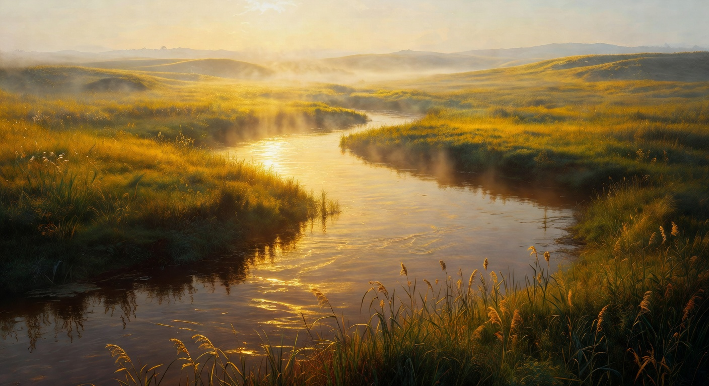
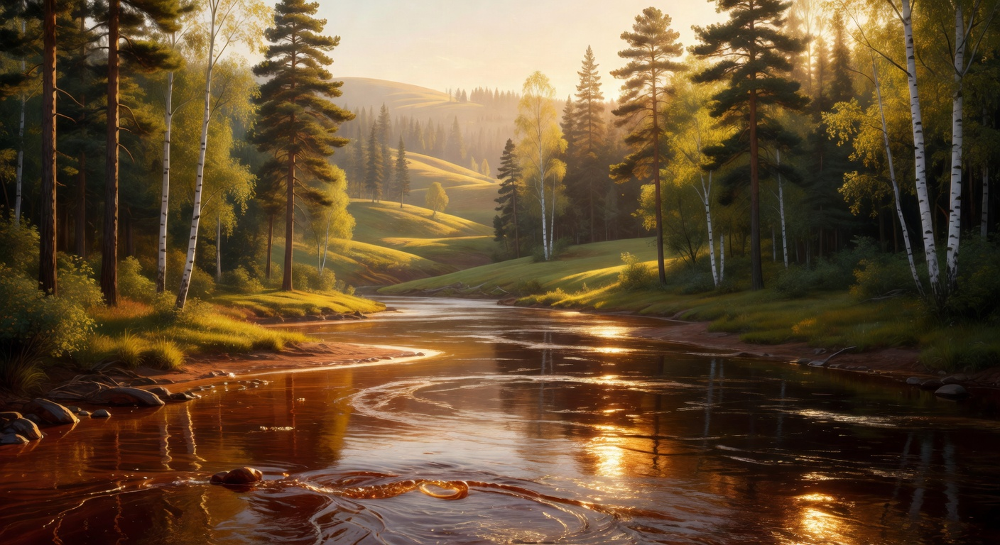

# Nature Background Collection

This collection contains 30 nature-themed river and landscape backgrounds for use as parallax layers in Wafflerace races.

## Theme & Style

- Rich natural environments: forests, rivers, mountains, wetlands, meadows, autumn woods, misty lakes, etc.
- **Warm, syrupy aesthetic** to match the waffle boat world (golden hour, amber/brown/green palette, cozy premium feel)
- Layer-friendly: distinct depth separation between far (distant hills/trees), mid (forest banks), and near (water surface, reeds, reflections)
- No hard horizon lines that would break parallax; soft atmospheric perspective is ideal
- Subtle water texture and sky gradients that work when scrolled at different speeds

## Current Status

- **5/30 images generated** (first batch complete)
- Folder structure ready (`jpg/` + `webp/`)
- Loader support enabled (supports up to 40 backgrounds per collection)

## First Batch Preview (5/30)

| 01 (Dense Pine Mist) | 02 (Autumn Hills) | 03 (Rocky Gorge Sunset) |
|----------------------|-------------------|-------------------------|
|  |  |  |

| 04 (Misty Wetland) | 05 (Pine & Birch Hills) |
|--------------------|-------------------------|
|  |  |

*Images shown from `jpg/` for gallery compatibility. Production uses the optimized `webp/` versions.*

## Naming Convention (Important)

All background collections **must** use the `bg-river-` prefix with zero-padded numbers for compatibility with the runtime loader:

- `bg-river-01.jpg` / `bg-river-01.webp`
- `bg-river-02.jpg` / `bg-river-02.webp`
- ...
- `bg-river-30.jpg` / `bg-river-30.webp`

The JS will attempt to load `bg-river-01` through `bg-river-40` inside the chosen collection folder and gracefully skip missing ones.

## Folder Structure

```
nature/
├── jpg/          # High-quality original JPGs (source of truth)
├── webp/         # Production-optimized WebP versions
└── README.md
```

## Usage

Once populated, select this collection at race start or via URL:

```
/race?bg=nature&names=Alice,Bob&duration=45
```

The three parallax layers are chosen randomly per race from the available images in the collection.

## Generation Guidelines

When creating new images:

1. 16:9-ish or wide landscape orientation suitable for 1100×420 canvas
2. Strong sense of depth (atmospheric haze, size scaling, color temperature shift)
3. Cohesive warm color story across the whole collection
4. After generation, copy originals into `jpg/`
5. Convert with: `mkdir -p webp && for f in jpg/bg-river-*.jpg; do cwebp -q 88 -m 6 "$f" -o "webp/$(basename ${f%.jpg}.webp)"; done` (or use the project's conversion helpers)

## Related

- [Default Background Collection](../default/README.md)
- [Main Backgrounds Index](../../README.md)
- [Boat Collections](../../../boats/README.md)