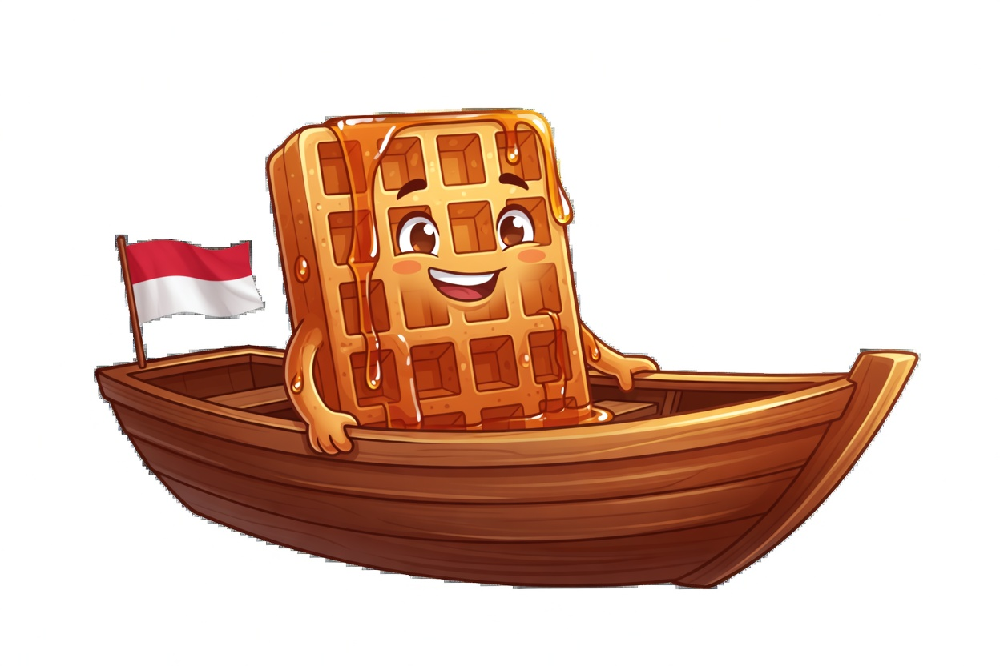

# Flags of the World — Boat Collection

This collection features boats representing the top 50 most populous countries in the world, each displaying that country's national flag on the racing pennant.

## Current Boats (5 / 50)

| India | China | United States | Indonesia | Pakistan |
|-------|-------|---------------|-----------|----------|
|  |  |  |  |  |

*More countries coming soon.*

## Theme Concept

- One boat per country featuring its official national flag
- The small triangular racing pennant on the back of the boat uses the country's flag
- Maintains the same warm, syrupy, premium cartoon illustration style as the other collections

## Current Status

- **v0.1.9** — First batch complete: Top 5 most populous countries (India, China, United States, Indonesia, Pakistan)
- Files organized in `png/`, `webp/`, and `originals/` following the project's strict asset pipeline.

**Completed countries:** India, China, United States, Indonesia, Pakistan

## Naming Convention

Files are named after the country in lowercase with hyphens where appropriate:

- `india.png`
- `united-states.webp`
- `south-korea.png`
- etc.

## Generation Notes

- Generated using Grok Imagine with the same strict rules as other collections
- Every boat must face **RIGHT** (critical rule)
- The racing flag must be on the **stern (left side)** of the boat
- Transparent background
- Consistent warm, syrupy aesthetic with the rest of Wafflerace

## Usage

You can load this collection in the race by adding the `collection` query parameter:

```
/race?collection=flags-of-world&names=Alice,Bob&duration=60
```

This is independent of the boat collection chosen at the start screen.

## Future Batches

The goal is the top 50 most populous countries. Future batches will continue in rough population order.

Ready-to-use prompt template (always include "boat facing RIGHT"):

```
Premium side-view illustration of a cheerful waffle character with maple syrup drips sitting in a classic wooden racing boat, the boat is facing right with the bow pointing to the right, a small triangular wind-blown racing pennant flag on the stern (back left side) of the boat clearly displays the [Country] national flag, warm golden syrupy lighting, rich amber and brown tones, transparent background, high quality digital art suitable for game sprite, consistent style with other waffle boat racers, no text
```

## Related

- [Boat Collections Index](../README.md)
- [Default Boat Collection](../default/README.md)
- [Flags of US Collection](../flags-of-us/README.md)